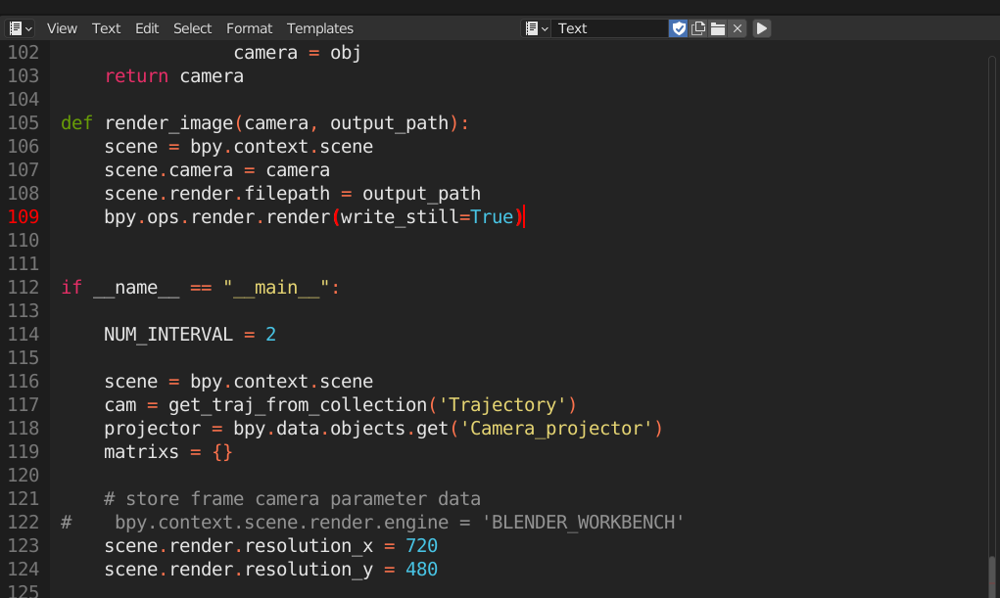
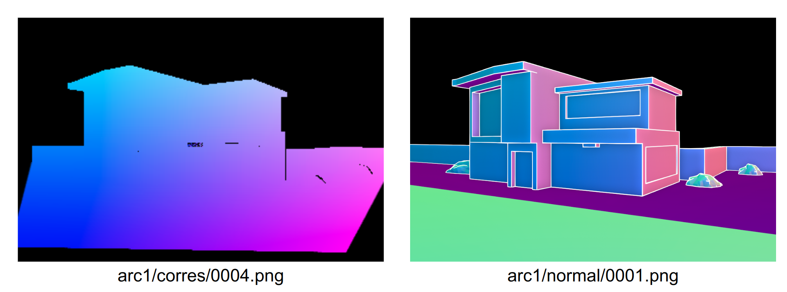
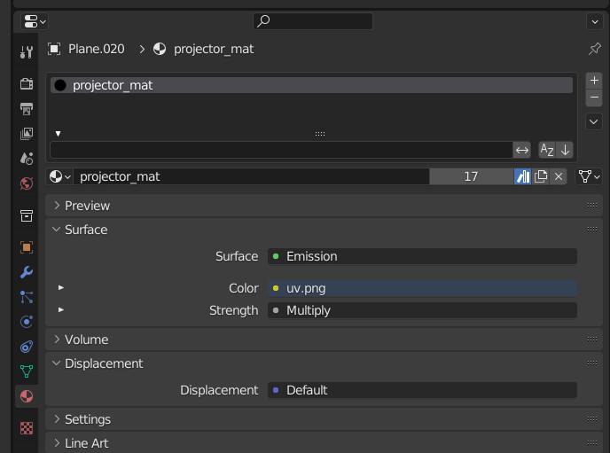

# Preprocessing Guide

This document provides a detailed explanation of the preprocessing procedure. 
The process requires **Blender** and several **Python scripts**. 
The tested Blender version is **3.1.2**.  
Since the preprocessing is relatively complex, we first introduce an **example workflow**, followed by a **customized usage guide**.

---

## 1. Example Workflow

### Open Blender File

A complete example is provided in `exampleA/town.blend`.  
Navigate to the `exampleA` directory and open the file in Blender:

```bash
# bash
> blender town.blend
```

---

### Outliner Window


In the **Outliner**, you will see three collections and one Line Art component.  
Their roles are as follows:

- **Geometry collection**: Target input geometry  
- **Trajectory collection**: Intended camera trajectory (path-tracking in this example)  
- **Projector collection**: Used for projector-based correspondence extraction (see Section F in the supplemental document)  
- **Line Art**: Visualizes edge maps from the input geometry (see Section E in the supplemental document)

For custom data, users only need to replace the **Geometry** and **Trajectory** collections. Details are explained later.

---

### Blender Script



In the script editor, you will find a Python script.
The code is divided into two parts: one renders the correspondence maps, and the other renders edge maps.  
When executed, this script will generate the following file structure under `exampleA`:

```
.
├── arc0
│   ├── corres
│   │   ├── 0004.png
│   │   ├── 0008.png
│   │   ...
│   ├── corres_end.png
│   └── normal
│       ├── 0001.png
│       ├── 0002.png
│       ...
└── arc1
    ├── corres
    │   ├── 0049.png
    │   ├── 0053.png
    │   ...
    ├── corres_end.png
    └── normal
        ├── 0046.png
        ├── 0047.png
        ...
```

Each `arcX` directory represents an interpolation interval. In this example, there are two intervals.  
The `corres` folder contains correspondence maps, while the `normal` folder contains visualized edge maps.  
`corres_end.png` is the correspondence map used by the **SAG module** for warping. 

Below are sample renderings for reference. If your results differ significantly, something may be wrong.



---

### Final Processing

To complete preprocessing, run the following command:

```bash
bash preprocess.sh --target exampleA
```

This script internally executes `mk_edge.py` and `mk_noise.py`. 
It estimates final edges using an **HED edge detector** and generates **warping noise** from the correspondence maps, respectively.

After completion, the following new files and folders will appear:

```
.
├── arc0
│   ├── corres_end.png
│   ├── noises.npy
│   └── hed
│       ├── 0001.png
│       ├── 0002.png
│       ...
```

This completes the preprocessing required for video generation using **SAG** and **GGI** modules.

---

## 2. Preprocessing for Custom Datasets

The above example shows preprocessing with the provided sample.  
This section explains how to apply preprocessing to **custom data**.

Instead of creating a new Blender project from scratch, it is recommended to start from the provided example and modify it as needed.  Users mainly need to update **Geometry** and **Trajectory** collections.

---

### Geometry

1. In the **Geometry** collection, remove the existing mesh.  
2. Create new coarse geometry or import a mesh from an external source.  
3. **Important:** Assign the material `projector_mat` to *all* objects in the geometry.  
   Otherwise, the projector will fail to project the UV map onto the geometry correctly.



---

### Camera Trajectory

There are two main ways to define a camera trajectory:  
1. Using a **path constraint** (path tracking)  
2. Manually setting **keyframes** and interpolating between them  

The above example uses the first method. The following YouTube tutorials provide quick introductions:

- [Path tracking](https://www.youtube.com/watch?v=1byaQygtcpc)  
- [Keyframe interpolation](https://www.youtube.com/watch?v=COwENnPwWJ8)

When editing the trajectory, keep the following three points in mind:

1. The new trajectory must be applied to **Camera.001**, since the Blender script directly references this camera.  
2. Do **not** modify camera intrinsics such as FOV. The projector assumes consistent intrinsic parameters, and changes will cause errors.  
3. Update `NUM_INTERVAL` in the Blender script according to your trajectory setup.  
   In the provided example, `NUM_INTERVAL = 2`, where each interval generates 46 frames.

```python
if __name__ == "__main__":
    NUM_INTERVAL = 2
    scene = bpy.context.scene
```

---

